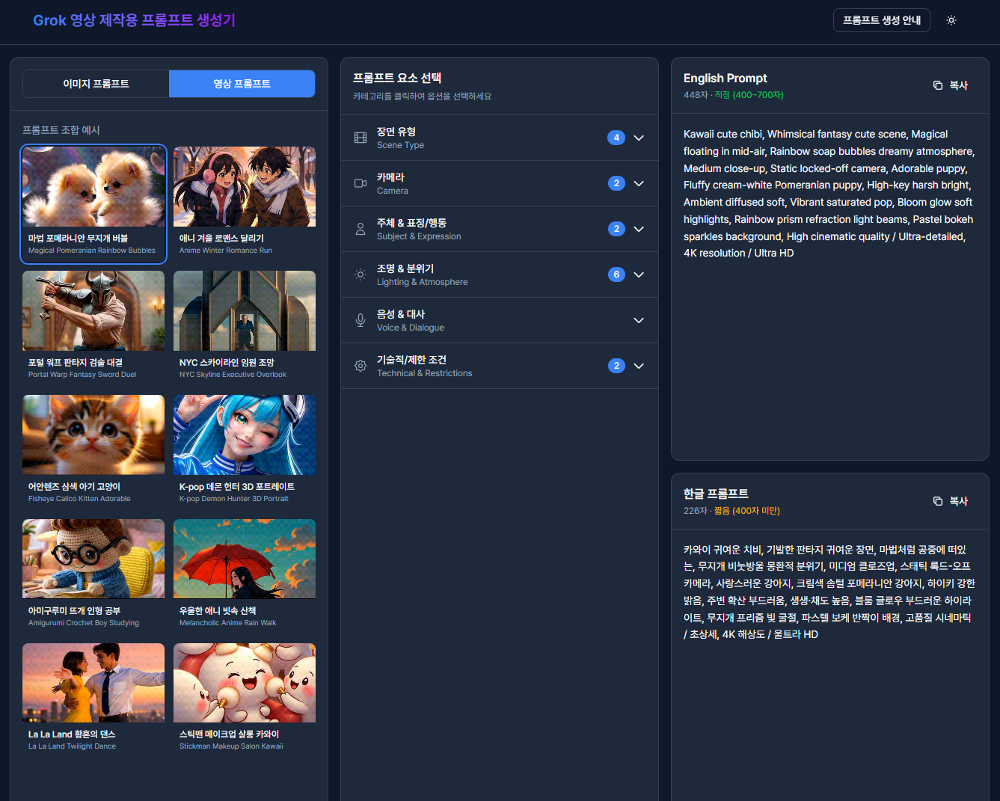

# Grok 영상 제작용 프롬프트 생성기

Grok Imagine AI를 위한 실시간 이미지/영상 프롬프트 생성기입니다. AI 없이 미리 정의된 500+ 프롬프트 요소를 조합하여 한국어/영어 프롬프트를 생성합니다.



## 주요 기능

### 1. 이중 언어 프롬프트 생성
- **영어 프롬프트**: Grok AI에 직접 사용 가능한 영어 프롬프트
- **한글 프롬프트**: 이해하기 쉬운 한국어 번역 프롬프트
- 실시간 글자 수 표시 (400~700자 적정 범위 안내)

### 2. 프롬프트 조합 예시 (프리셋)
- 10개의 영상 프롬프트 프리셋 제공
- 썸네일 클릭으로 즉시 프롬프트 옵션 자동 선택
- 이미지/영상 모드 전환 지원

### 3. 6개 카테고리 프롬프트 요소
| 카테고리 | 설명 |
|---------|------|
| **장면 유형** | 영화 장르, 판타지, SF, 애니메이션, 자연/분위기, 아트 스타일 |
| **카메라** | 앵글, 샷 타입, 렌즈, 카메라 움직임 (영상 전용) |
| **주체 & 표정/행동** | 나이/성별, 종족, 스타일, 의상, 표정, 행동, 감정 |
| **조명 & 분위기** | 조명 스타일, 분위기 색상, 시각 효과 |
| **음성 & 대사** | 음성 스타일 (영상 전용) |
| **기술적/제한 조건** | 해상도, 품질, 화면비 |

### 4. 편의 기능
- **원클릭 복사**: 영어/한글 프롬프트 각각 복사 버튼
- **아코디언 UI**: 카테고리별 접기/펼치기
- **선택 항목 배지**: 각 카테고리별 선택된 옵션 수 표시
- **다크 모드**: 시스템 설정 연동 + 수동 전환

## 기술 스택

- **Framework**: Next.js 16 (App Router, Turbopack)
- **Styling**: Tailwind CSS + 다크모드
- **State**: Zustand (localStorage persist)
- **Language**: TypeScript
- **Icons**: Lucide React

## 시작하기

### 설치

```bash
npm install
```

### 개발 서버 실행

```bash
npm run dev
```

[http://localhost:3000](http://localhost:3000)에서 확인

### 프로덕션 빌드

```bash
npm run build
npm start
```

## 프로젝트 구조

```
Grok_Imagine/
├── app/                    # Next.js App Router
├── components/
│   ├── layout/            # Header, InfoModal
│   └── panels/            # 4패널 UI 컴포넌트
├── data/
│   ├── categories/        # 6개 카테고리 옵션 데이터
│   └── presets/           # 프리셋 데이터
├── store/                 # Zustand 상태 관리
├── lib/                   # 프롬프트 빌더 로직
└── public/thumbnails/     # 프리셋 썸네일 GIF
```

## 라이선스

MIT License
